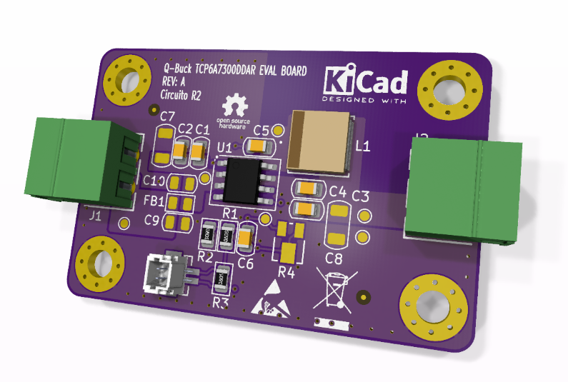
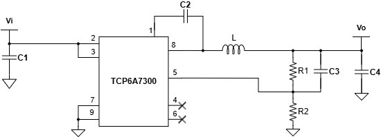
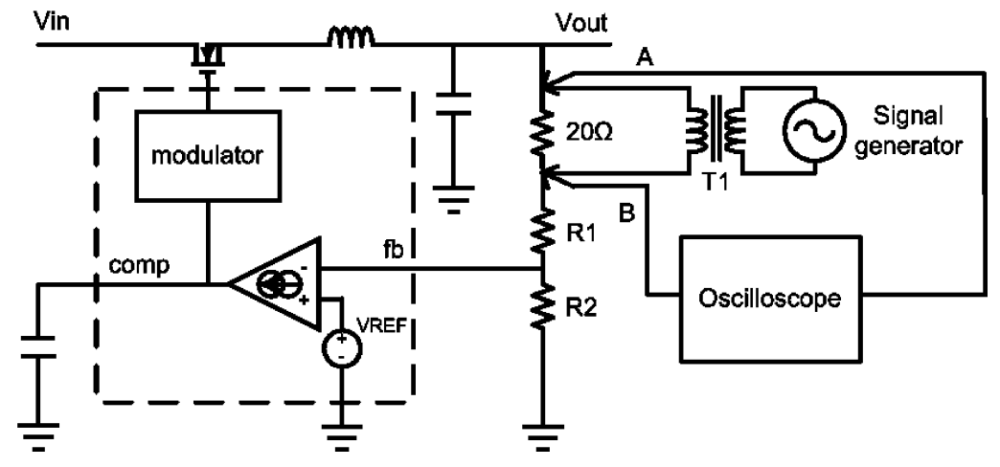

View this project on [CADLAB.io](https://cadlab.io/project/30117) or [kicanvas.org](https://kicanvas.org/?repo=https%3A%2F%2Fgithub.com%2Falanmonu12%2Fq-buck-TCP6A7300DDAR%2Ftree%2Fdevelop). 

# Q-Buck TCP6A7300DDAR EVAL BOARD MX <!-- omit in toc -->

Una placa de evaluación Open Source Hardware (OSHW) diseñada para probar y caracterizar el convertidor Buck síncrono TCP6A7300DDAR, un circuito integrado diseñado en México por QSM Semiconductores. Esta placa está pensada como un primer paso para validar el comportamiento térmico, la estabilidad del lazo de control y la eficiencia del IC bajo  condiciones reales, con miras a integrarlo en proyectos educativos e industriales más grandes.

  

## Tabla de Contenido <!-- omit in toc -->

- [Características del IC (TCP6A7300DDAR)](#características-del-ic-tcp6a7300ddar)
- [Diseño Orientado a la Validación (Design for Testability)](#diseño-orientado-a-la-validación-design-for-testability)
- [Ecuaciones y Diseño Preliminar](#ecuaciones-y-diseño-preliminar)
- [Lista de Materiales (BOM) y Consideraciones de Ensamblaje](#lista-de-materiales-bom-y-consideraciones-de-ensamblaje)
- [Especificaciones de Manufactura y Stackup](#especificaciones-de-manufactura-y-stackup)
- [Estado del Proyecto](#estado-del-proyecto)
- [Referencias y Documentación](#referencias-y-documentación)
- [License](#license)

## Características del IC (TCP6A7300DDAR)

El núcleo de este proyecto es la evaluación en hardware del convertidor TCP6A7300DDAR, un circuito integrado diseñado y manufacturado en México. La motivación principal es impulsar la industria electrónica nacional, demostrando que es posible integrar silicio de origen local en topologías de potencia confiables.

- Voltaje de Entrada ($V_{IN}$): 3.8V a 35V
- Corriente de Salida: 3A Continuos
- Frecuencia de Conmutación: 500 kHz
- Voltaje de Referencia ($V_{REF}$): 0.8V
- Topología: Step-Down (Buck) Síncrono
- Empaquetado: SOP-8 con *Exposed Pad*

  
   
  <em>Topología básica de aplicación del IC.</em>

## Diseño Orientado a la Validación (Design for Testability)

Esta tarjeta fue pensada para ir mucho más allá de ser una simple implementación de referencia del IC TCP6A7300DDAR. Su arquitectura está pensada como un entorno de laboratorio para enseñar, experimentar y comprender a fondo los fenómenos dinámicos y electromagnéticos que rigen a las fuentes conmutadas. 

Para lograr esto, la placa integra características específicas de validación:

- **Análisis de Estabilidad y Lazo de Control:** Cuenta con un punto de inyección de señal. Esto permite aislar el lazo de retroalimentación en corriente alterna (AC) para inyectar pequeña señal y extraer el Diagrama de Bode utilizando instrumentos como el Analog Discovery 3, facilitando el estudio práctico del Margen de Fase y Ganancia.
- **Filtro Pi para Mitigación EMI:** Se integraron footprints opcionales a la entrada para conformar un filtro Pi pasivo (dos capacitores cerámicos separados por un Ferrite Bead o inductor de alta frecuencia). Esto permite a los ingenieros evaluar empíricamente la atenuación del ruido conducido, entender el filtrado de armónicos y analizar cómo la impedancia de entrada afecta la estabilidad del convertidor. 
- **Flexibilidad de Operación:** Diseñada por defecto para entregar un riel estable de 5V, incluye opciones de montaje para un potenciómetro de ajuste, esto facilita la ejecución de barridos de voltaje.

  
   
  <em> Diagrama de referencia (TI) para la inyección de pequeña señal AC en el lazo de retroalimentación. La placa de evaluación integra este arreglo físico mediante el resistor de inyección flotante y conectores SMD dedicados.</em>

## Ecuaciones y Diseño Preliminar

El circuito actual está calculado para un escenario típico de reducción de voltaje (ej. batería de $12V/24V$ a $5V$ para lógica).

**Parámetros de Diseño:**

- $V_{IN(max)} = 35V$
- $V_{OUT} = 5V$
- $I_{OUT} = 1A$
- $f_{sw} = 500 kHz$

**1. Lazo de Retroalimentación (Feedback)**

El divisor de voltaje se calcula basándose en la referencia interna de 0.8V. Asignando $R_2 = 10k\Omega$:

$$R_1 = R_2 \left( \frac{V_{OUT}}{V_{REF}} - 1 \right)$$
$$R_1 = 10k\Omega \left( \frac{5V}{0.8V} - 1 \right) = 52.5 k\Omega$$

   >[!NOTE]
   >
   > En el esquemático se utiliza el valor comercial estándar más cercano de $56k\Omega$, lo que resulta en un $V_{OUT}$ real aproximado de $5.28V$.

**2. Cálculo del Inductor ($L$)**

Se asume un rizado de corriente ($\Delta I_L$) del 30% de la corriente de salida nominal ($I_{OUT} = 2A$), resultando en $\Delta I_L = 600mA$.

$$L = \frac{V_{OUT} (V_{IN} - V_{OUT})}{V_{IN} \cdot f_{sw} \cdot \Delta I_L}$$
$$L = \frac{5V (35V - 5V)}{35V \cdot 500kHz \cdot 600mA} = 14.28 \mu H$$

   >[!NOTE]
   >
   > Se elige un valor comercial estándar de $10 \mu H$, lo que aumentará ligeramente el rizado de corriente, pero mejorará la respuesta transitoria.

**3. Capacitor de Salida ($C_{OUT}$)**

Para mantener un rizado de voltaje en la salida ($\Delta V_{OUT}$) menor a $20mV$:

$$C_{OUT} = \frac{\Delta I_L}{8 \cdot f_{sw} \cdot \Delta V_{OUT}}$$
$$C_{OUT} = \frac{600mA}{8 \cdot 500kHz \cdot 20mV} = 7.5 \mu F$$

   >[!NOTE]
   >
   > Se utiliza un valor estándar de $10 \mu F$ con un capacitor cerámico multicapa.

## Lista de Materiales (BOM) y Consideraciones de Ensamblaje

Este prototipo fue diseñado bajo una filosofía de **"tropicalización" y rápida iteración**. Todos los componentes pasivos seleccionados son de montaje superficial (SMD tamaño 0805) y están restringidos a números de parte comerciales que se pueden adquirir inmediatamente en el mercado local mexicano (ej. Unit Electronics), evitando tiempos de importación.

Reference|	Qty|	Part number|	Value|	DNP|	Footprint|	Supplier |
| :--- | :--- | :--- | :--- | :--- | :--- | :--- |
C1, C4, C5|	3|	CC0805KRX7R9BB104|	0.1uF|	|	0805_2012Metric|	[Link](https://uelectronics.com/producto/cc0805krx7r9bb104-capacitor-ceramico-0805-100nf-50v/) |
C2|	1|	UMK212ABJ225KG-T|	2.2uF|	|	0805_2012Metric|	[Link](https://uelectronics.com/producto/umk212abj225kg-t-capacitor-ceramico-0805-2-2uf-50v/) |
C3|	1|	TMK212BBJ106KG-T|	10uF|	| 0805_2012Metric|	[Link](https://uelectronics.com/producto/tmk212bbj106kg-t-capacitor-ceramico-0805-10uf-25v/) |
C6|	1|	CL21C101JBANNNC|	100pF|	|	0805_2012Metric|	[Link](https://uelectronics.com/producto/capacitor-ceramico-0805-100pf-50v-cl21c101jbannnc/) |
C7, C8|	2|	CL31B106KBHNNNE|	10uF|	DNP|	1206_3216Metric|	[Link](https://uelectronics.com/producto/cl31b106kbhnnne-capacitor-ceramico-1206-10uf-50v/) |
C9, C10|	2|	CC0805KRX7R9BB104|	0.1uF|	DNP|	0805_2012Metric|	[Link](https://uelectronics.com/producto/cc0805krx7r9bb104-capacitor-ceramico-0805-100nf-50v/) |
FB1|	1|	DNP|	DNP|	DNP|	0805_2012Metric|	|
J1, J2|	2|	691322310002|	691322310002|	|	TH |	|
J3|	1|	BM02B-SRSS-TB LFSN|	BM02B-SRSS-TB LFSN|	|	SMD|	[Link](https://uelectronics.com/producto/conectores-sh1-0mm-verticales/) |
L1|	1|	SWPA6020S100MT|	10uH|	|	IND_SWPA6020S_SNL|	[Link](https://uelectronics.com/producto/indutor-de-ferrita-10uh-1-15a-slf0403-100mtt/?srsltid=AfmBOooOqTnwMiDMHeULKfOL0IrJwGuaZDGph-w8FWtPsK44g1PSEBvX) |
R1|	1|	RC0805JR-0756KL|	56K|	|	0805_2012Metric|	[Link](https://uelectronics.com/producto/resistor-56k-ohm-1-8w-smd-0805-rs-05k6802ft/) |
R2|	1|	0805W8F1002T5E|	10K|	|	0805_2012Metric|	[Link](https://uelectronics.com/producto/resistor-10k-ohm-1-8w-smd-0805-0805w8f2202t5e/?srsltid=AfmBOooCz4q4fAaZYE-h_EAgrFxCbTD7xwc4qPOiGFs1Ch7HIS5tJjUF) |
R3|	1|	RTT05000JTP|	0R|	|	0805_2012Metric|	[Link](https://uelectronics.com/producto/resistor-0-ohm-1-8w-smd-0805-rtt05000jtp/) |
R4|	1|	TC33X-2-103E|	100K|	DNP|	SMD |	[Link](https://uelectronics.com/producto/trimpot-smd-10k-ohm-3x3-8mm-tc33x-2-103e/) |
U1|	1|	TCP6A7300DDAR|	TCP6A7300DDAR|	|	SOIC-8-1EP_ThermalVias|	|

> [!NOTE]
> 
> Los footprints marcados como **DNP** (Do Not Populate) en el esquemático, se dejaron intencionalmente vacíos para permitir soldar componentes adicionales durante la fase de validación en banco de pruebas.

## Especificaciones de Manufactura y Stackup

Para obtener buenos resultados térmicos y electromagnéticos, la tarjeta fue diseñada utilizando un perfil de manufactura de 4 capas estándar. El objetivo es que cualquier ingeniero pueda mandar a fabricar este diseño en casas ensambladoras de bajo costo (como JLCPCB o PCBWay) sin tener en cargos extras por procesos avanzados.

**Características Físicas de la Placa:**

* **Dimensiones:** 45.0 mm x 30.0 mm.
* **Grosor Total:** 1.6 mm.
* **Acabado Superficial:** HAL Lead-Free (HASL libre de plomo RoHS).
* **Reglas de Diseño (DRC):** Ruteo robusto con pista/separación mínima de 0.2 mm (aprox. 8 mils) y diámetro de perforación (vías) mínimo de 0.3 mm. 

**Análisis del Stackup (Cobre de 1 oz):**

* **Capa 1 (Top) - Señal y Potencia:** Aloja todos los componentes SMD, el "Hot Loop" y el nodo SW.
* **Capa 2 (In1) - Plano de Tierra Sólido (GND):** Actúa como escudo de Faraday y ruta de retorno de baja impedancia.
* **Capa 3 (In2) - Plano de Tierra (GND):** aporta masa térmica adicional para la disipación del IC. Utilizada para llevar la señal sensible de retroalimentación (Feedback) protegida entre dos planos de tierra.
* **Capa 4 (Bottom) - Ruteo y Planos Auxiliares:**  Utilizada para llevar la señal sensible de retroalimentación (Feedback).

## Estado del Proyecto

- [x] Cálculo de componentes pasivos.
- [x] Captura del Esquemático (KiCad).
- [x] Diseño del PCB (Layout y consideraciones térmicas).
- [ ] Ensamble del primer prototipo.
- [ ] Pruebas de caracterización y respuesta en frecuencia (FRA).

## Referencias y Documentación

[1]: [Basic Calculation of a Buck Converter's Power Stage (SLVA477B)](https://www.ti.com/lit/an/slva477b/slva477b.pdf)

[2]: [How to Measure the Loop Transfer Function of Power Supplies (AN-1889 / SNVA364A)](https://www.ti.com/lit/an/snva364a/snva364a.pdf)

[3]: [Analysis and Design of Input Filter for DC-DC Circuit (SNVA801)](https://www.ti.com/lit/pdf/snva801)

[4]: [Design a Second-stage Filter for Sensitive Applications (SSZT824)](https://www.ti.com/lit/pdf/sszt824)

[5]: [How to select input capacitors for a buck converter](https://www.ti.com/lit/an/slyt670/slyt670.pdf)

[6]: [Improve High-Current DC/DC Regulator EMI Performance for Free With Optimized Power Stage Layout](https://www.ti.com/lit/ab/snva803/snva803.pdf?ts=1772697173603)

[7]: [DC-DC PCB Layout Design for EMC](https://www.diodes.com/assets/App-Note-Files/AN1191-DC-DC-PCB-Layout-Design-for-EMC.pdf)

## License

This project is licensed under the CC BY-NC-SA 4.0 License. See the LICENSE file for details.
